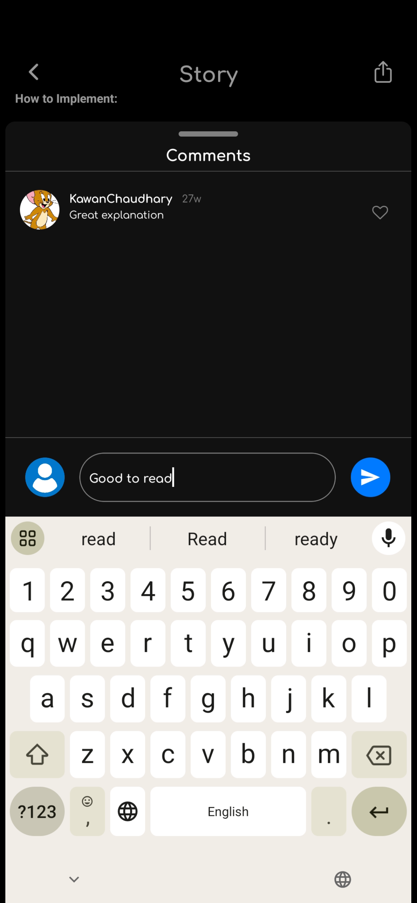

<h1 align="center">MIND FUEL Mobile App</h1>

<h4><span style="color: red;">Fullstack open source mobile blogging application made with Firebase, MongoDB, Express, React Native & Node.js</span></h4>
<br/>

## Content
  - Live website link
  - Key Features
  - Technologies used
  - Configuration and Setup
  - Author
  - License

## App Live link

<h4>Check the live website : <a href="https://mindfuel-web-fe.onrender.com/" target="_blank"> Click here </a> 🚀</h4>

<h5>If you enjoy the content, please register and contribute a well-written story.</h5>

<h5>🎥 Experience it now! <a href="https://drive.google.com/drive/folders/1uwiQVI3L8ioike5vbp3t5SeF0pn9n5Ru?usp=drive_link" target="_blank">Download the android app or watch the demo video here</a> 📲</h5>

##  Key Features

- User registration and login
- Authentication using JWT Tokens
- Story searching with debouncing 
- CRUD operations (Story create, read, update and delete)
- Upload user images and story images to the server
- Liking stories and adding stories to the Reading list
- Commenting on the story
- Skeleton loading effect
- Responsive Design
- Sharing direct link on social handles
- Optmized Flatlist
- Global state management with redux and implemented redux-saga
- Theme switching using Context API

### Screenshots

<table>
  <tr>
    <td align="center"><br/>Home Screen</td>
    <td align="center"><br/>Skeleton Loader</td>
    <td align="center"><br/>Story Details Screen</td>
    <td align="center"><br/>Comment Modal</td>
  </tr>
  <tr>
    <td align="center"><br/>Register Screen</td>
    <td align="center"><br/>Add Comment</td>
    <td align="center"><br/>Bookmarks</td>
    <td align="center"><br/>Profile Screen</td>
  </tr>
  <tr>
    <td align="center"><br/>Edit Profile</td>
    <td align="center"><br/>Setting Screen</td>
    <td align="center"><br/>Add Story Modal</td>
    <td align="center"><br/>Add Story Screen with Text Editor</td>
  </tr>
  <tr>
    <td align="center"><br/>Share Story</td>
    <td align="center"><br/>Share Message</td>
  </tr>
</table>

##  Technologies used

This project was created using the following technologies.

####  Mobile App 
- [React Native CLI](https://www.npmjs.com/package/@react-native-community/cli) - Command line tools that help you build apps with react-native.
- [React Hooks](https://reactjs.org/docs/hooks-intro.html) - For managing and centralizing application state
- [React Native Navigation](https://www.npmjs.com/package/@react-navigation/stack) - To handle navigation
- [axios](https://www.npmjs.com/package/axios) - For making Api calls
- [Css](https://developer.mozilla.org/en-US/docs/Web/CSS) - For User Interface
- [Rich Pell Editor](https://www.npmjs.com/package/react-native-pell-rich-editorl) - Document Text Editor 
- [React Native Flash Message](https://www.npmjs.com/package/react-native-flash-message) - For displaying flash messages
- [React native vector icons](https://www.npmjs.com/package/react-native-vector-icons/v/10.0.3) - Small library that helps you add icons  to your react apps.
- [React Native Reanimated](https://www.npmjs.com/package/react-native-reanimated) - It provides a more comprehensive, low level abstraction for the Animated library API.
- [React Native Gesture Handler](https://www.npmjs.com/package/react-native-gesture-handler) - It provides a more comprehensive, low level abstraction for the Animated library API.


## Configuration and Setup

>**Note**: Make sure you have completed the [React Native - Environment Setup](https://reactnative.dev/docs/environment-setup) instructions till "Creating a new application" step, before proceeding.

<h4>To setup backend : <a href="https://github.com/KawanChaudhary/mindfuel_web" target="_blank"> Click here </a> 🚀</h4>


In order to run this project locally, simply fork and clone the repository or download as zip and unzip on your machine.

- Open the project in your prefered code editor.
- Go to terminal -> New terminal (If you are using VS code)
- To start Metro, run the following command from the _root_ of your React Native project:

>**Note**: Replace your backend Url in src\axiosInstance.js

```bash

# using npm

npm start
```


## Step 2: Start your Application


Let Metro Bundler run in its _own_ terminal. Open a _new_ terminal from the _root_ of your React Native project. Run the following command to start your _Android_ or _iOS_ app:


### For Android


```bash

# using npm

npm run android

```


### For iOS


```bash

# using npm

npm run ios
```


If everything is set up _correctly_, you should see your new app running in your _Android Emulator_ or _iOS Simulator_ shortly provided you have set up your emulator/simulator correctly.


This is one way to run your app — you can also run it directly from within Android Studio and Xcode respectively.


## Congratulations! :tada:


You've successfully run and modified your React Native App. :partying_face:


# Troubleshooting

If you can't get this to work, see the [Troubleshooting](https://reactnative.dev/docs/troubleshooting) page.

## Author
- Github: [kawanchaudhary](https://github.com/KawanChaudhary)
- Linkedin: [kawanchaudhary](https://www.linkedin.com/in/kawanchaudhary/)
- Email: [kawanchaudhary@gmail.com](mailto:kawanchaudhary@gmail.com)

## License

This project is licensed under the MIT License.
